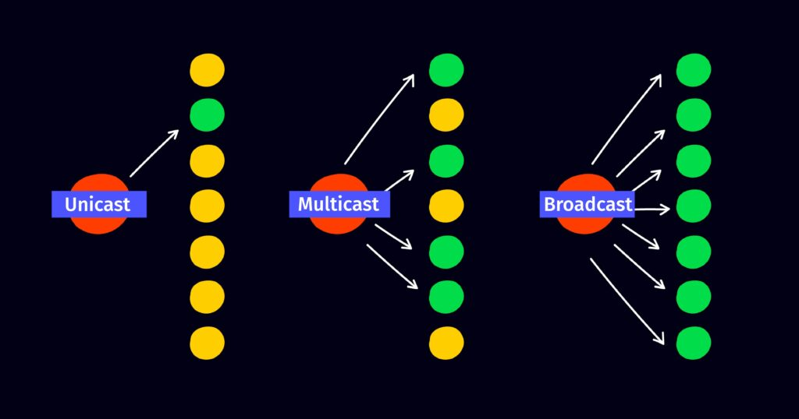

# IGMP
Internet Group Management Protocol  
여러 장치가 하나의 IP를 공유, 동일한 데이터를 수신  
Multicasting에 사용  

- IGMP Snooping : 라우터와 Host 사이의 스위치가 IGMP 메시지를 가져옴
    - 불필요한 Traffic 감소
- IGMP Version
    - IGMP v1
        - Host → membership report → 라우터
        - 위 과정을 통해 group 가입
        - 라우터 → membership query → Host
        - 위 과정을 통해 group activate 확인 및 protocol 실행
    - IGMP v2
        - v1과 동일하나 Host에서 leave report를 통해 multicast group 탈퇴 가능
    - IGMP v3
        - SSM(Source Specific Multicast)
            - Source Filtering 가능
            - Host에서 특정 Source에서만 Traffic을 받도록 설정 가능
            - Include mode : 특정 Source만 요청
            - Exclude mode : 특정 Source를 제외하고 요청
        - Max Responce Time 추가
        - leave report 없음 : Empty Include report를 통해 multicast group에서 제외

### Multicast
별도의 IP와 MAC 주소 지정 방식, 이를 지원하기 위한 별도의 Protocol을 통해 1:N Transport  
Multicast Group 설정 및 관리리

- UDP(User Datagram Protocol) : 상대방이 데이터를 받았는지 확인하지 않는다.
- TCP(Transmission Control Protocol) : 높은 신뢰성, 속도가 느리다. 1:1 통신, 수신여부를 확인

